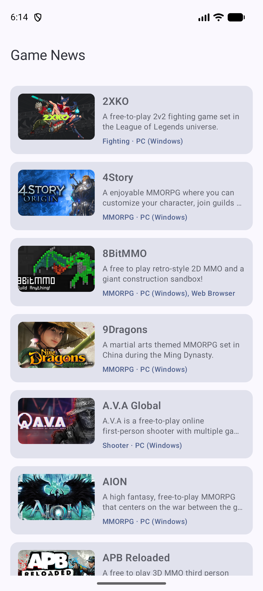
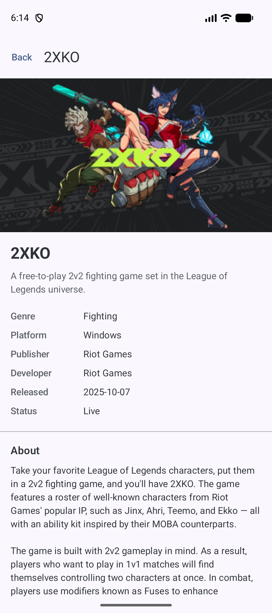

# Game News

An offline-first Android browser for free-to-play games, backed by the public
[FreeToGame API](https://www.freetogame.com/api). Two screens: a list of games and a
detail screen with description, screenshots and minimum system requirements.

Kotlin · Jetpack Compose · Room · Retrofit · Hilt · Coroutines/Flow · 30 tests

The database is the single source of truth, so the app opens straight into cached content
and a failed refresh never blanks the screen. [ARCHITECTURE.md](ARCHITECTURE.md) covers
the layering and the reasoning behind it.

## Screenshots

| List | Detail |
| --- | --- |
|  |  |

## Requirements

| Tool | Version |
| --- | --- |
| JDK | 21 (the Gradle daemon toolchain is pinned to 21) |
| Android SDK | Platform 36.1 (`compileSdk 36.1`, `targetSdk 36`, `minSdk 24`) |
| Gradle | 9.4.1 via the wrapper — do not install it separately |

No API key, no account and no signing config for debug builds. The app needs an internet
connection on first launch to fill the cache; after that it opens offline, showing the
cached list while the failed refresh is absorbed rather than blanking the screen.

The only local setup is telling Gradle where your Android SDK is, since
`local.properties` is not in version control. Either export `ANDROID_HOME`:

```bash
export ANDROID_HOME="$HOME/Library/Android/sdk"   # macOS default
```

or create `local.properties` in the project root with a single line:

```properties
sdk.dir=/Users/you/Library/Android/sdk
```

Android Studio writes that file for you on first sync, so this step only applies when
building from the command line. Without it the build stops with
`SDK location not found`.

## Run it on an emulator

From a clean checkout, with no Android Studio involved:

```bash
# 0. Point Gradle at your SDK (see above) if you have not already.
export ANDROID_HOME="$HOME/Library/Android/sdk"
export PATH="$ANDROID_HOME/cmdline-tools/latest/bin:$ANDROID_HOME/emulator:$ANDROID_HOME/platform-tools:$PATH"

# 1. Create and start an emulator (skip if you already have one running).
#    Any API 24+ image works; this uses API 36 on Apple silicon — swap arm64-v8a for
#    x86_64 on an Intel host. `yes |` accepts the SDK licence non-interactively, and
#    `echo "no" |` declines avdmanager's custom-hardware-profile prompt, which it
#    otherwise blocks on.
yes | sdkmanager "system-images;android-36;google_apis;arm64-v8a"
echo "no" | avdmanager create avd -n gamenews -k "system-images;android-36;google_apis;arm64-v8a"
emulator -avd gamenews &

# 2. Wait until the device reports as ready.
adb wait-for-device shell 'while [ "$(getprop sys.boot_completed)" != 1 ]; do sleep 1; done'

# 3. Build, install and launch.
./gradlew installDebug
adb shell am start -n com.example.gamenews/.MainActivity
```

`sdkmanager`, `avdmanager`, `emulator` and `adb` all ship with the Android SDK, under
`$ANDROID_HOME/cmdline-tools/latest/bin`, `$ANDROID_HOME/emulator` and
`$ANDROID_HOME/platform-tools` respectively — which is what step 0 puts on `PATH`.

**In Android Studio:** open the project root, let Gradle sync, pick a device and run the
`app` configuration. Nothing else to configure.

**Watching it work.** Debug builds log every HTTP call at body level:

```bash
adb logcat | grep OkHttp
```

You should see `--> GET https://www.freetogame.com/api/games` followed by `<-- 200`, which
is the only network call the list screen makes. Everything the UI renders is read back out
of Room.

## Build

```bash
./gradlew assembleDebug          # debug APK -> app/build/outputs/apk/debug/app-debug.apk
./gradlew installDebug           # build and install on a connected device/emulator
```

## Tests and checks

```bash
./gradlew testDebugUnitTest      # 23 JVM unit tests
./gradlew connectedDebugAndroidTest   # 7 instrumented tests (needs a running emulator)
./gradlew detekt                 # static analysis; a finding fails the build
./gradlew check                  # detekt, Android lint and the unit tests
```

```
app/src/test/java/com/example/gamenews/          JVM — no device needed
  data/mapper/GameMapperTest.kt                  DTO -> Entity -> domain conversions
  data/repository/GameRepositoryImplTest.kt      offline-first read/write behaviour
  ui/list/GameListViewModelTest.kt               list screen state machine
  ui/detail/GameDetailViewModelTest.kt           detail state machine (Robolectric)
  fake/                                          FakeGameApi, FakeGameDao, FakeGameRepository
  util/MainDispatcherRule.kt                     Dispatchers.Main swap for viewModelScope

app/src/androidTest/java/com/example/gamenews/   on-device
  data/local/GameDaoTest.kt                      real SQLite: queries, converters, Flow emissions
```

No mocking framework. The fakes implement the real interfaces and are backed by
`MutableStateFlow`, so a write is observable through the read `Flow` — which is the
offline-first property the tests are there to assert, rather than a stubbed return value
restating the assumption.

## Module layout

Single Gradle module (`:app`), split by package:

```
com.example.gamenews
  data/     remote (Retrofit + DTOs), local (Room), mapper, repository
  domain/   model, repository interfaces
  ui/       list, detail, components, theme, navigation host
  di/       Hilt modules
```

Dependencies point inward: `ui` and `data` both depend on `domain`, and `domain` knows
about neither. The UI never sees a DTO, an Entity, or a Retrofit or Room type.
`ARCHITECTURE.md` covers why this is one module, why there are three representations of a
game, and why there are no use cases yet.
